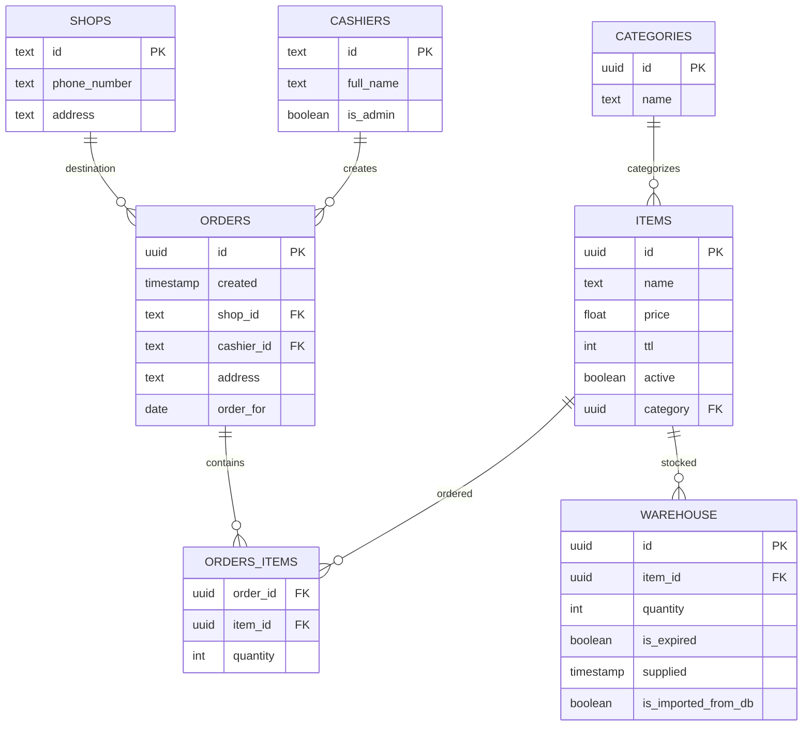
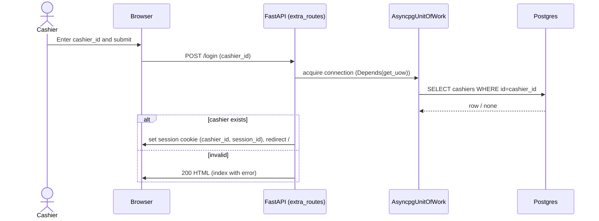
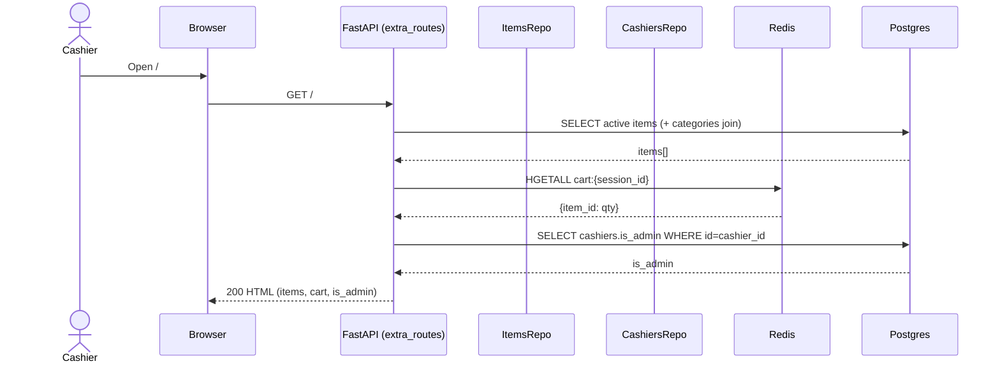
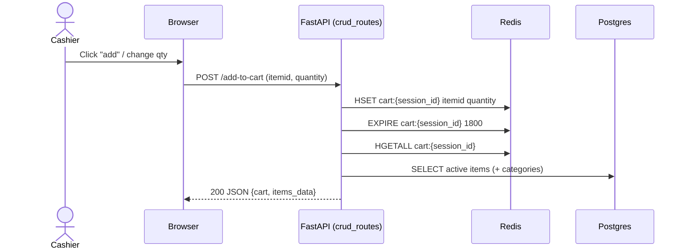
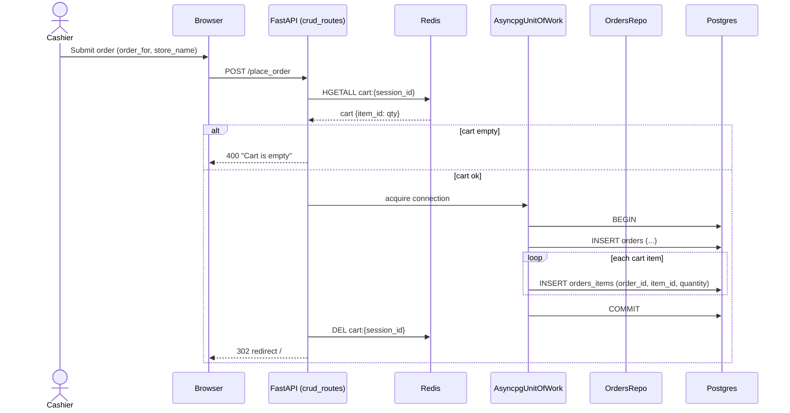
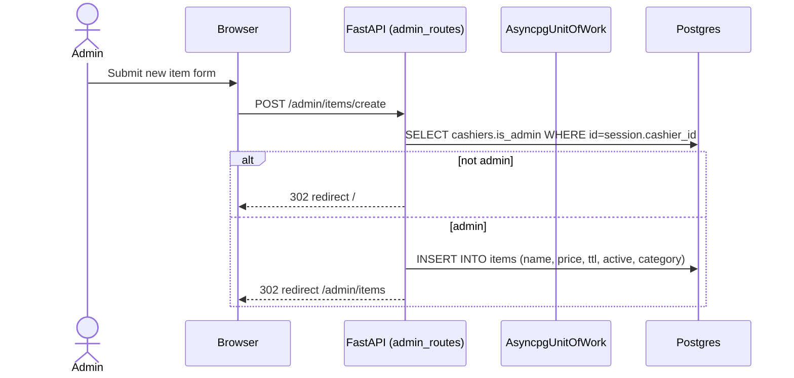
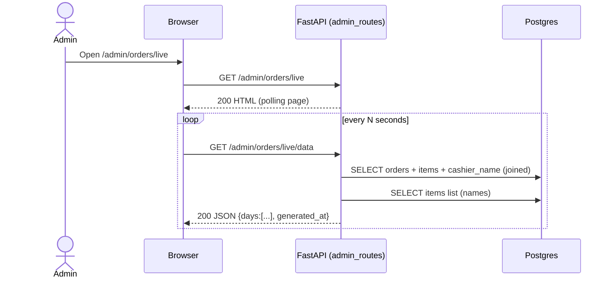
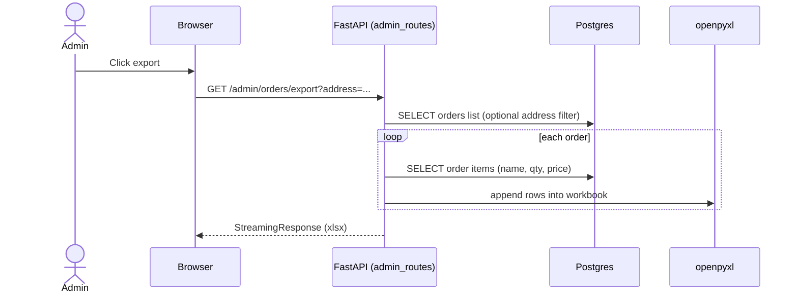

# Project UML / Sequence Specification (Backend Only)

This document describes the **backend** in this repository (everything except `frontend/`) in a way that can be used to generate:

- **UML component/package diagrams** (modules + dependencies)
- **UML class/ER diagrams** (data model)
- **Sequence diagrams** (runtime flows)

Tech stack (backend):

- **FastAPI** (HTTP API + server-rendered pages via Jinja2 templates)
- **PostgreSQL** via **asyncpg** (primary data store)
- **Redis** via `redis.asyncio` (cart storage)
- **Session cookies** via Starlette `SessionMiddleware` (auth/session state)
- **Nginx** reverse proxy + TLS termination (optional, in `nginx/nginx.conf`)
- **Docker Compose** for local orchestration (`docker-compose.yml`)

---

## System context (actors and external systems)

- **Cashier (user)**: logs in using a cashier ID; browses items; adds to cart; places orders; views own orders.
- **Admin (user)**: a cashier with `cashiers.is_admin = true`; manages items/categories; views/export orders; uses “live orders” dashboards.
- **Browser / Client**: submits HTML form posts and fetches JSON for dynamic updates.
- **FastAPI app**: main backend process (`uvicorn app.main:app`).
- **PostgreSQL**: stores master data and orders.
- **Redis**: stores per-session cart as a hash.
- **Nginx (optional)**: proxies `https://...` to the FastAPI container.

---

## Deployment & runtime topology

### Docker Compose services

Defined in `docker-compose.yml`:

- **`db`**: `postgres:17`, exposes `5432` (mapped to `${DB_PORT}`).
- **`redis`**: Redis server, default port 6379 (internal in compose network).
- **`web`**: FastAPI app container running Uvicorn on `:8000`.
- **`migrate`**: runs Yoyo migrations against `${DB_URL_MIGRATIONS}`.
- **`nginx`**: TLS reverse proxy forwarding to `web:8000`.

### FastAPI app lifecycle

Entrypoint: `app/main.py`

- On **startup**:
  - creates an **asyncpg pool** and stores it in `app.state.db`
  - initializes `app.state.cart` (legacy; active cart is in Redis)
- On **shutdown**:
  - closes Redis connection
  - closes asyncpg pool

---

## Code organization (packages/modules)

Root backend package: `app/`

- **`app.main`**
  - creates FastAPI app
  - mounts `/static`
  - registers routers: `extra_routes`, `crud_routes`, `admin_routes`
  - adds `SessionMiddleware` and `CORSMiddleware`

- **`app.routes.*` (transport layer)**
  - `extra_routes.py`: index/login/logout + JSON `/api/data`
  - `crud_routes.py`: cart operations + place order + views for cashier orders
  - `admin_routes.py`: admin pages, item/category management, order dashboards and exports
  - `deps.py`: DI for Unit of Work and cart repo
  - `session_utils.py`: session_id creation

- **`app.services.*` (application/business layer)**
  - `AuthService`: auth/authorization checks against DB
  - `IndexService`: builds UI/API response payloads for index/dashboard
  - `CartService`: cart read/write/clear operations (delegates to Redis repo)
  - `OrderService`: validates and creates orders transactionally
  - `PublicService`: item listing for non-admin flows
  - `AdminService`: admin operations (CRUD + exports + live dashboard payload shaping)

- **`app.infrastructure.*` (data access layer)**
  - `uow.py`: `AsyncpgUnitOfWork` provides repositories bound to a single acquired connection
  - `repos/*.py`: SQL access for items, orders, cashiers, shops
  - `redis/cart_repo.py`: Redis cart storage

- **`migrations/`**
  - SQL migrations (Yoyo) defining the DB schema and evolutions

- **`nginx/nginx.conf`**
  - reverse proxy to `web:8000` + LetsEncrypt cert paths

---

## Runtime component diagram (conceptual)

You can render this as a Mermaid component diagram (or translate to UML tooling):

```mermaid
flowchart LR
  Browser[Browser / Client] -->|HTTP| FastAPI[FastAPI app]

  FastAPI -->|SQL (asyncpg)| Postgres[(PostgreSQL)]
  FastAPI -->|Redis hash ops| Redis[(Redis)]

  subgraph FastAPI_Internal[FastAPI internal layers]
    Routes[Routes: app.routes.*]
    Services[Services: app.services.*]
    UoW[AsyncpgUnitOfWork]
    Repos[Repos: app.infrastructure.repos.*]
    CartRepo[RedisCartRepo]
    Routes --> Services
    Services --> UoW
    UoW --> Repos
    Services --> CartRepo
  end

  Nginx[Nginx TLS proxy] -. optional .->|proxy_pass| FastAPI
```

---

## Transport layer (HTTP endpoints)

All endpoints are defined in:

- `app/routes/extra_routes.py`
- `app/routes/crud_routes.py`
- `app/routes/admin_routes.py` (prefix `/admin`)

### Public / cashier endpoints (HTML + JSON)

- `GET /`
  - If not logged in: shows login form.
  - If logged in: shows items + cart + admin flag.

- `POST /login` (form)
  - Inputs: `cashier_id`
  - Side effects: sets `session['cashier_id']` and creates `session['session_id']`

- `POST /logout`
  - Clears Redis cart for this `session_id` (if present)
  - Clears the session

- `GET /api/data` (JSON)
  - Requires session `cashier_id`
  - Returns `items`, `cart`, `is_admin`

- `POST /add-to-cart` (JSON)
  - Inputs: `itemid`, `quantity`, optional `tg_id`
  - Uses `session_id` (creates if missing)
  - Writes to Redis, returns updated `cart` + refreshed `items_data`

- `POST /remove-from-cart` (redirect)
  - Inputs: `item_id`
  - Writes quantity=0 to Redis, redirects to `/`

- `POST /place_order` (redirect)
  - Inputs: `order_for` (YYYY-MM-DD), optional `store_name`, optional `tg_id`
  - Requires session `cashier_id` and `session_id`
  - Reads cart from Redis
  - Creates order + order items in Postgres (transaction)
  - Clears Redis cart

- `GET /orders` (HTML)
  - Shows today’s orders for logged-in cashier, grouped by order and date

- `GET /orders/archive` (HTML)
  - Shows past orders (before today)

- `GET /orders/future` (HTML)
  - Shows future orders (after today)

### Admin endpoints (HTML + JSON + file exports)

Admin authorization model:

- Admin is a cashier with `cashiers.is_admin = true`
- Each admin route calls `AuthService.ensure_admin(uow, cashier_id_from_session)`

Endpoints (prefix `/admin`):

- `GET /admin/items` (HTML): list items + categories
- `POST /admin/items/create` (form): create item with optional category
- `POST /admin/items/delete` (form): delete item
- `POST /admin/items/toggle` (form): bulk update item `active` + category mapping

- `POST /admin/categories/create` (form): create category (unique name)
- `POST /admin/categories/update` (form): rename category

- `GET /admin/orders` (HTML): order list filtered by `order_for_date` and/or `address`
- `POST /admin/orders/delete` (form): delete an order (and its order items)

“Live orders” (polling JSON):

- `GET /admin/orders/live` (HTML): page (JS polls JSON endpoints)
- `GET /admin/orders/live/data` (JSON): recent “live” payload (up to 5 days)
- `GET /admin/orders/live/archive` (HTML)
- `GET /admin/orders/live/archive/data` (JSON): older “archive” payload (days after the first 5)

Exports (Excel streams):

- `GET /admin/orders/export` (xlsx): export orders (optionally filtered by address)
- `GET /admin/export/by_address?order_for=YYYY-MM-DD` (xlsx): grouped by address for a date
- `GET /admin/orders/live/export/totals?order_for=YYYY-MM-DD` (xlsx): totals per item for a date
- `GET /admin/export/all_items?order_for=YYYY-MM-DD` (xlsx): totals per item across all addresses for a date

---

## Data model (PostgreSQL)

Source of truth: `migrations/*.sql`

### Tables and relationships (as implemented)

- `shops`
  - `id (text PK)`
  - `phone_number (text)`
  - `address (text)`

- `cashiers`
  - `id (text PK)`
  - `full_name (text)`
  - `is_admin (bool, default false)`

- `categories`
  - `id (uuid PK)`
  - `name (text UNIQUE NOT NULL)`

- `items`
  - `id (uuid PK)`
  - `name (text)`
  - `price (float)`
  - `ttl (int)` (days)
  - `active (bool NOT NULL default true)`
  - `category (uuid FK -> categories.id)` (nullable)

- `warehouse` (present in schema; not actively used by current backend flows)
  - `id (uuid PK)`
  - `item_id (uuid FK -> items.id)`
  - `quantity (int)`
  - `is_expired (bool)`
  - `supplied (timestamp)`
  - `is_imported_from_db (bool)`

- `orders`
  - `id (uuid PK)`
  - `created (timestamp default now())`
  - `shop_id (text FK -> shops.id)` (nullable in practice; app currently passes `None`)
  - `cashier_id (text FK -> cashiers.id)`
  - `address (text)`
  - `order_for (date NOT NULL default current_date)`

- `orders_items` (join table)
  - `order_id (uuid FK -> orders.id)`
  - `item_id (uuid FK -> items.id)`
  - `quantity (int)`
  - composite PK `(order_id, item_id)`

- `shops_orders` (join table; not actively used by current backend flows)
  - `shop_id (text FK -> shops.id)`
  - `order_id (uuid FK -> orders.id)`
  - composite PK `(shop_id, order_id)`

### ER diagram (Mermaid)



---

## State model (session + cart)

### Session cookie state

Stored in signed cookie via `SessionMiddleware`:

- `cashier_id`: string; indicates logged-in cashier identity
- `session_id`: UUID string; used as the Redis cart key namespace
- `tg_id`: optional string; stored when provided (currently not used in order creation)

### Redis cart state

Repository: `app/infrastructure/redis/cart_repo.py`

- Key: `cart:{session_id}`
- Type: Redis hash
- Field: `item_id` (string UUID)
- Value: `quantity` (int)
- TTL: 1800 seconds (refreshed on updates)

---

## Domain / application flows (sequence diagrams)

Notes for diagram generation:

- The diagrams below use **Mermaid sequence diagrams**; most UML tools can be derived from these interactions.
- `UoW` means `AsyncpgUnitOfWork`, which acquires a DB connection per request.

### 1) Login (cashier)



### 2) Load index page (logged-in cashier)



### 3) Add to cart (AJAX)



### 4) Place order (transactional create)



### 5) Admin: create item + assign category



### 6) Admin: live orders dashboard polling



### 7) Admin: export orders (xlsx streaming)



---

## Key business rules and validations

- **Authentication**
  - “Login” is simply verifying `cashiers.id` exists.
  - Authorization for admin routes is checking `cashiers.is_admin`.

- **Cart**
  - Cart is ephemeral (Redis TTL 30 minutes).
  - Quantity \(<= 0\) removes an item from cart.

- **Order creation**
  - Requires non-empty cart.
  - `order_for` must parse as `YYYY-MM-DD`, else 400.
  - Uses DB transaction to insert order + join rows.
  - `address` uses `store_name` if present, else default fallback.
  - Current code sets `shop_id = None` (shop integration is present in schema but not active).

---

## Notable implementation quirks (useful for accurate diagrams)

- **Two parallel “UI” surfaces exist**:
  - server-rendered Jinja templates (`app/templates/*`)
  - JSON endpoint `/api/data` + JSON cart update `/add-to-cart`

- **Deprecated background worker**:
  - `app/worker.py` is marked “DEPRECATED” and references RabbitMQ.
  - Docker Compose currently comments out RabbitMQ.

- **Schema vs code mismatch to be aware of**
  - DB schema defines `orders_items` join table.
  - Some legacy SQL in `app/db.py` references `order_items` (singular) and appears unused by current routes/services.

---

## Diagram generation checklist (what to include)

If you’re generating diagrams, the minimal set that represents the system well:

- **Component / container diagram**
  - Browser → FastAPI → Postgres
  - Browser → FastAPI → Redis
  - (Optional) Nginx → FastAPI

- **ER diagram**
  - `cashiers`, `items`, `categories`, `orders`, `orders_items`
  - optionally `shops`, `warehouse`, `shops_orders`

- **Sequence diagrams**
  - Login
  - Add-to-cart
  - Place order
  - Admin item management
  - Admin live dashboard polling
  - Admin export xlsx

