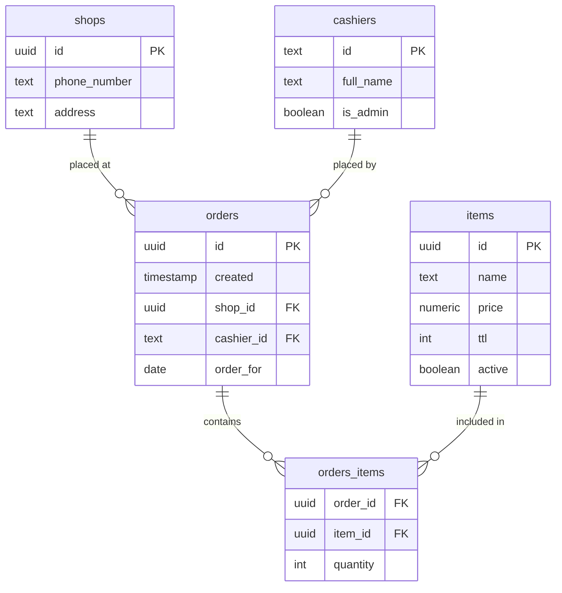

```mermaid
erDiagram
    shops {
        uuid id PK
        text phone_number
        text address
    }
    items {
        uuid id PK
        text name
        numeric price
        int ttl
        boolean active
    }

    cashiers {
        text id PK
        text full_name
        boolean is_admin
    }
    orders {
        uuid id PK
        timestamp created
        uuid shop_id FK
        text cashier_id FK
        date order_for
    }
    orders_items {
        uuid order_id FK
        uuid item_id FK
        int quantity
    }


    shops ||--o{ orders : "placed at"
    cashiers ||--o{ orders : "placed by"
    orders ||--o{ orders_items : "contains"
    items ||--o{ orders_items : "included in"

```
