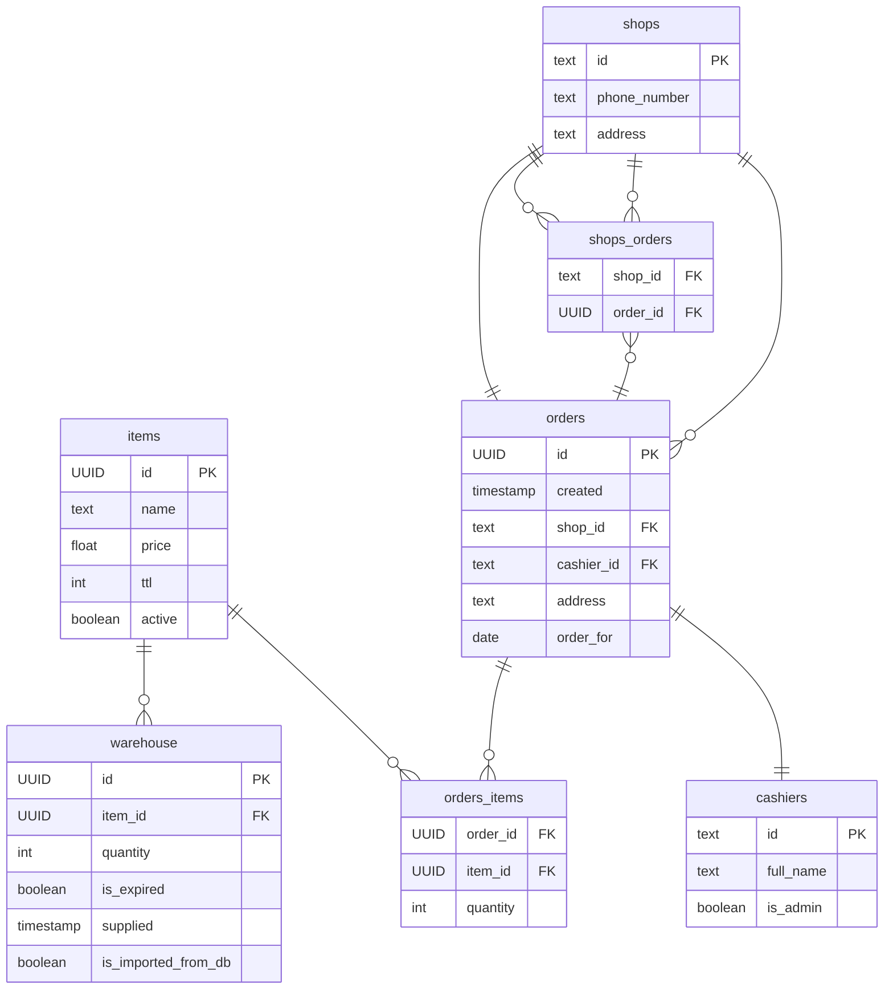

```mermaid
erDiagram
    shops {
        text id PK
        text phone_number
        text address
    }
    items {
        UUID id PK
        text name
        float price
        int ttl
        boolean active
    }
    warehouse {
        UUID id PK
        UUID item_id FK
        int quantity
        boolean is_expired
        timestamp supplied
        boolean is_imported_from_db
    }
    cashiers {
        text id PK
        text full_name
        boolean is_admin
    }
    orders {
        UUID id PK
        timestamp created
        text shop_id FK
        text cashier_id FK
        text address
        date order_for
    }
    orders_items {
        UUID order_id FK
        UUID item_id FK
        int quantity
    }
    shops_orders {
        text shop_id FK
        UUID order_id FK
    }
    
    shops ||--o{ orders : ""
    shops ||--o{ shops_orders : ""
    orders ||--o{ orders_items : ""
    orders ||--|| cashiers : ""
    orders ||--|| shops : ""
    shops_orders }o--|| orders : ""
    shops_orders }o--|| shops : ""
    items ||--o{ warehouse : ""
    items ||--o{ orders_items : ""

```