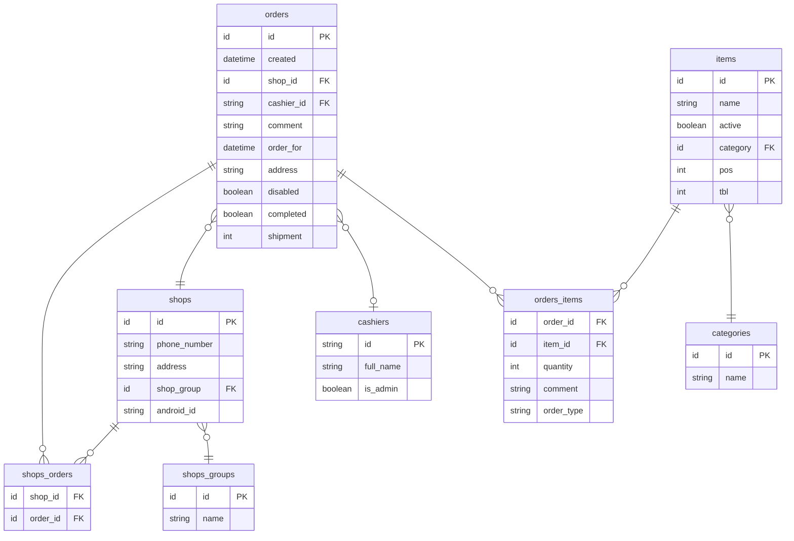

```mermaid
erDiagram
    shops {
        id id PK
        string phone_number
        string address
        id shop_group FK
        string android_id
    }

    shops_groups {
        id id PK
        string name
    }

    shops_orders {
        id shop_id FK
        id order_id FK
    }

    orders {
        id id PK
        datetime created
        id shop_id FK
        string cashier_id FK
        string comment
        datetime order_for
        string address
        boolean disabled
        boolean completed
        int shipment
    }

    orders_items {
        id order_id FK
        id item_id FK
        int quantity
        string comment
        string order_type
    }

    items {
        id id PK
        string name
        boolean active
        id category FK
        int pos
        int tbl
    }

    categories {
        id id PK
        string name
    }

    cashiers {
        string id PK
        string full_name
        boolean is_admin
    }

    shops ||--o{ shops_orders : ""
    orders ||--o{ shops_orders : ""
    shops }o--|| shops_groups : ""
    orders }o--|| shops : ""
    orders }o--o| cashiers : ""
    orders ||--o{ orders_items : ""
    items ||--o{ orders_items : ""
    items }o--|| categories : ""
```